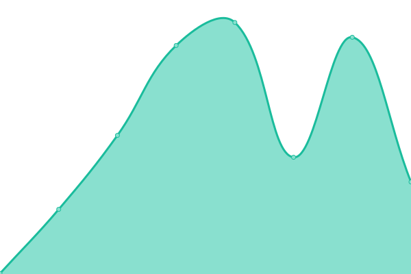
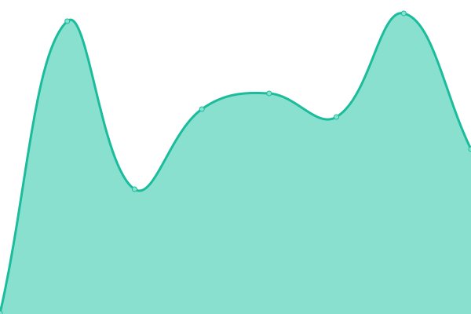
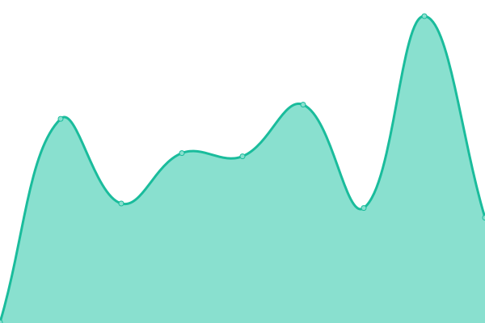

# [📈 Live Status](https://status.camplegal.com): <!--live status--> **🟩 All systems operational**

This repository contains the open-source uptime monitor and status page for [CampLegal](https://status.camplegal.com), powered by [Upptime](https://github.com/upptime/upptime).

With [Upptime](https://upptime.js.org), you can get your own unlimited and free uptime monitor and status page, powered entirely by a GitHub repository. We use [Issues](https://github.com/CampLegal/camplegal-status/issues) as incident reports, [Actions](https://github.com/CampLegal/camplegal-status/actions) as uptime monitors, and [Pages](https://status.camplegal.com) for the status page.

<!--start: status pages-->
<!-- This summary is generated by Upptime (https://github.com/upptime/upptime) -->
<!-- Do not edit this manually, your changes will be overwritten -->
<!-- prettier-ignore -->
| URL | Status | History | Response Time | Uptime |
| --- | ------ | ------- | ------------- | ------ |
|  [Lawyer Portal](https://lawyer.camplegal.com/) | 🟩 Up | [lawyer-portal.yml](https://github.com/camplegal-llc/camplegal-status/commits/HEAD/history/lawyer-portal.yml) | 

 316ms
     
 | 

<a href="https://camplegal-llc.github.io/camplegal-status/history/lawyer-portal">100.00%</a>
    

|  [Customer Portal](https://client.camplegal.com/login) | 🟩 Up | [customer-portal.yml](https://github.com/camplegal-llc/camplegal-status/commits/HEAD/history/customer-portal.yml) | 

 358ms
     
 | 

<a href="https://camplegal-llc.github.io/camplegal-status/history/customer-portal">98.82%</a>
    

|  [Corp Portal](https://corp.camplegal.com/login) | 🟩 Up | [corp-portal.yml](https://github.com/camplegal-llc/camplegal-status/commits/HEAD/history/corp-portal.yml) | 

 347ms
     
 | 

<a href="https://camplegal-llc.github.io/camplegal-status/history/corp-portal">98.82%</a>
    

|  [API](https://api.camplegal.com/api/v1/mobile/ping) | 🟩 Up | [api.yml](https://github.com/camplegal-llc/camplegal-status/commits/HEAD/history/api.yml) | 

 324ms
     
 | 

<a href="https://camplegal-llc.github.io/camplegal-status/history/api">100.00%</a>
    

<!--end: status pages-->

[**Visit our status website →**](https://status.camplegal.com)

## 📄 License

- Powered by: [Upptime](https://github.com/upptime/upptime)
- Code: [MIT](./LICENSE) © [Anand Chowdhary](https://anandchowdhary.com), supported by [Pabio](https://pabio.com)
- Data in the `./history` directory: [Open Database License](https://opendatacommons.org/licenses/odbl/1-0/)
